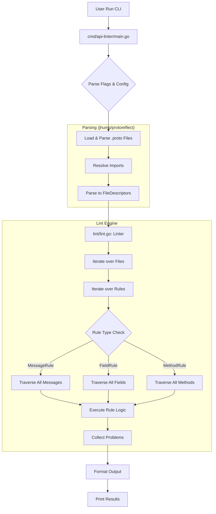

# Codebase Walkthrough: api-linter Execution Flow

This document details the lifecycle of a linting request, from command-line invocation to the final report.

## 1. Execution Overview

The `api-linter` follows a **Load -> Parse -> Lint -> Report** pipeline.

---

## 2. Phase 1: CLI Entry & Configuration
**Files:** `cmd/api-linter/main.go`, `cmd/api-linter/cli.go`

1.  **Registry Initialization:** In `main.go`, an `init()` function calls `rules.Add(globalRules)`. This imports every AIP rule package and registers them into a central `RuleRegistry`.
2.  **Flag Handling:** `newCli()` uses `pflag` to capture user intent (output format, enabled/disabled rules, import paths).
3.  **Config Merging:** `lint()` reads optional YAML configuration files and merges them with CLI-provided overrides to create the final `lint.Configs` object.

## 3. Phase 2: Input Parsing
**File:** `cmd/api-linter/cli.go` (Method: `lint`)

The tool utilizes `github.com/jhump/protoreflect` for "dynamic" parsing of Protobuf source files.

1.  **Protoparse:** A `protoparse.Parser` is configured with the provided `ProtoImportPaths`.
2.  **Source Metadata:** Unlike the standard `protoc` compiler which discards metadata during code generation, `protoparse` retains **SourceCodeInfo**. This includes comments and precise line/column locations for every element in the `.proto` file, which is essential for reporting lint errors.
3.  **Descriptors:** The parser produces `desc.FileDescriptor` objects, which are rich, reflective representations of the API schema.

## 4. Phase 3: The Linting Engine
**Files:** `lint/lint.go`, `lint/rule.go`

The `Linter` acts as a coordinator between descriptors and rules.

1.  **The Outer Loop:** `LintProtos` iterates over every parsed file.
2.  **The Inner Loop:** For each file, the linter checks every rule in the registry.
3.  **Activation Check:** `l.configs.IsRuleEnabled(...)` determines if a rule should run for the current file based on user configuration.
4.  **Polymorphic Traversal:** Rules implement specific interfaces (e.g., `MessageRule`).
    *   The engine calls `rule.Lint(fd)`.
    *   The rule wrapper (e.g., in `lint/rule.go`) handles the boilerplate of finding all target elements (all messages, all fields, etc.) in the file.
    *   The wrapper then invokes the specific AIP logic for each element.

## 5. Phase 4: Rule Evaluation
**Files:** `rules/aepXXXX/...`

This is where the AIP-specific business logic lives. A rule generally consists of two parts:

1.  **Filter (`OnlyIf`):** A predicate that decides if the rule applies to a specific descriptor (e.g., "Is this a Get method?").
2.  **Logic (`LintXXX`):** The actual check. It inspects the descriptor properties (name, types, options) and returns a slice of `lint.Problem` if violations are found.

## 6. Phase 5: Reporting
**File:** `cmd/api-linter/cli.go`

1.  **Comment Suppression:** The engine filters out any `Problem` that occurs on a line where the user has added a disable comment (e.g., `// api-linter: core::0131::request-message-name=disabled`).
2.  **Formatting:** The results are passed to a `marshal` function based on the `--output-format` flag:
    *   `yaml`/`json`: Raw structured data.
    *   `summary`: A human-readable ASCII table.
    *   `github`: GitHub Actions workflow commands.
3.  **Exit Strategy:** If problems are found and `--set-exit-status` is true, the tool returns `ExitForLintFailure`, causing the process to exit with status `1`.
