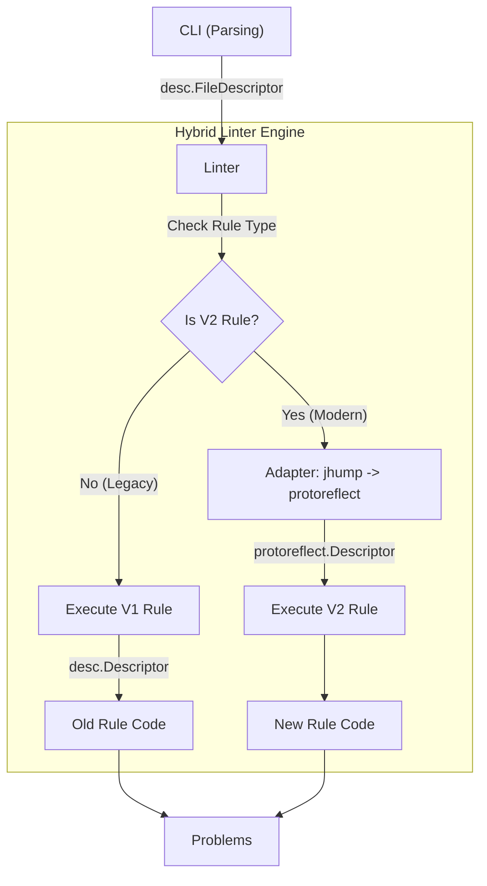

# Design: Phased Migration to Protoreflect V2

**Status:** Proposed
**Goal:** Migrate `api-linter` from `jhump/protoreflect` to `google.golang.org/protobuf/reflect/protoreflect` incrementally, allowing mixed-mode operation.

## 1. The Challenge
The current `Linter` and `Rule` interfaces are tightly coupled to `jhump/protoreflect`.
*   **Parsing:** The CLI uses `protoparse` (jhump).
*   **Rules:** Every rule signature expects `*desc.MessageDescriptor` (jhump).
*   **Utils:** Helper libraries expect `jhump` types.

A "Big Bang" rewrite is too risky for a volunteer team. We need a bridge.

## 2. The Bridge Strategy: "Core-First" vs "Parser-First"
Since we control the `Linter` engine, we can make it multilingual. The key insight is that `jhump` descriptors *can* expose their underlying `protoreflect` descriptors (or we can use adapters).

However, the cleanest path is to keep the **Parser** as `jhump` for now (legacy mode), but allow the **Linter Engine** to convert those descriptors to `protoreflect` when handing them to a "V2 Rule".

### Architectural Diagram



## 3. Phased Execution Plan

### Phase 1: The Dual-Mode Core (The "Adapter")
**Goal:** Allow defining a rule using `protoreflect` types.

1.  **Define V2 Interfaces:** In `lint/rule.go`, define `NewProtoRule`, `NewMessageRule`, etc., (or simply `MessageRuleV2`) that accept functions with `protoreflect` signatures.
    ```go
    type MessageRuleV2 struct {
        LintMessage func(protoreflect.MessageDescriptor) []Problem
        // ...
    }
    ```
2.  **Update `Problem` Struct:** `lint/problem.go` must hold *either* a `desc.Descriptor` (old) or a `protoreflect.Descriptor` (new).
3.  **Update Linter Loop:** In `lint/lint.go`:
    *   Iterate rules as usual.
    *   If a rule implements the V2 interface:
        *   Take the current `*desc.FileDescriptor`.
        *   Call `.UnwrapFile()` (provided by jhump v1.15+) or cast to `protoreflect.FileDescriptor`.
        *   Pass the unwrapped descriptor to the rule.

### Phase 2: The Utility Bridge
**Goal:** Allow rule authors to write V2 rules without reimplementing every helper function.

1.  **Parallel Utils:** Create `rules/internal/utils/v2/` (or similar).
2.  **Port Common Utils:** Copy the most critical functions (`IsResource`, `GetFieldBehavior`) to the new package, updated for `protoreflect`.

### Phase 3: Incremental Rule Migration
**Goal:** Migrate rules one AIP at a time.

1.  **Pick a Victim:** Start with a simple AIP (e.g., AIP-0192).
2.  **Refactor:** Rewrite `rules/aep0192/has_comments.go` to use `MessageRuleV2` and `protoreflect`.
3.  **Test:** Update the rule's tests.
    *   *Note:* Tests might need a similar adapter to parse test protos into `protoreflect` descriptors.

### Phase 4: Flip the Parser (The Final Switch)
**Goal:** Remove `jhump` entirely.

1.  **Switch CLI:** Replace `jhump/protoparse` with `bufbuild/protocompile` in `cmd/api-linter/cli.go`.
2.  **Remove Adapter:** Now the Linter receives `protoreflect` descriptors natively.
3.  **Retire V1:** Delete the V1 rule interfaces and the `Adapter` logic.

## 4. Implementation Refinements (Pilot Findings)
During the pilot migration (see `docs/analysis/04-pilot-learnings.md`), we refined the design:

*   **CommonRule Interface:** We introduced a `CommonRule` interface because the `RuleRegistry` and `buf-plugin` need to handle both V1 and V2 rules in a single collection.
*   **Adapter Logic:** We use `protodesc.NewFile` instead of `UnwrapFile` for broader compatibility, and lazy-load the V2 descriptor only when a V2 rule is active.
*   **Dependency Resolution:** Tests for V2 rules need to manually register dependencies (like `aep/api/resource.proto`) into a `protoregistry` to convert descriptors successfully.

## 5. Benefits of this Approach
*   **Non-Blocking:** Multiple contributors can migrate different AIPs in parallel.
*   **Safe:** We verify the "Core" changes first.
*   **Shippable:** At no point is the linter broken. We can ship a release with 50% V1 rules and 50% V2 rules.