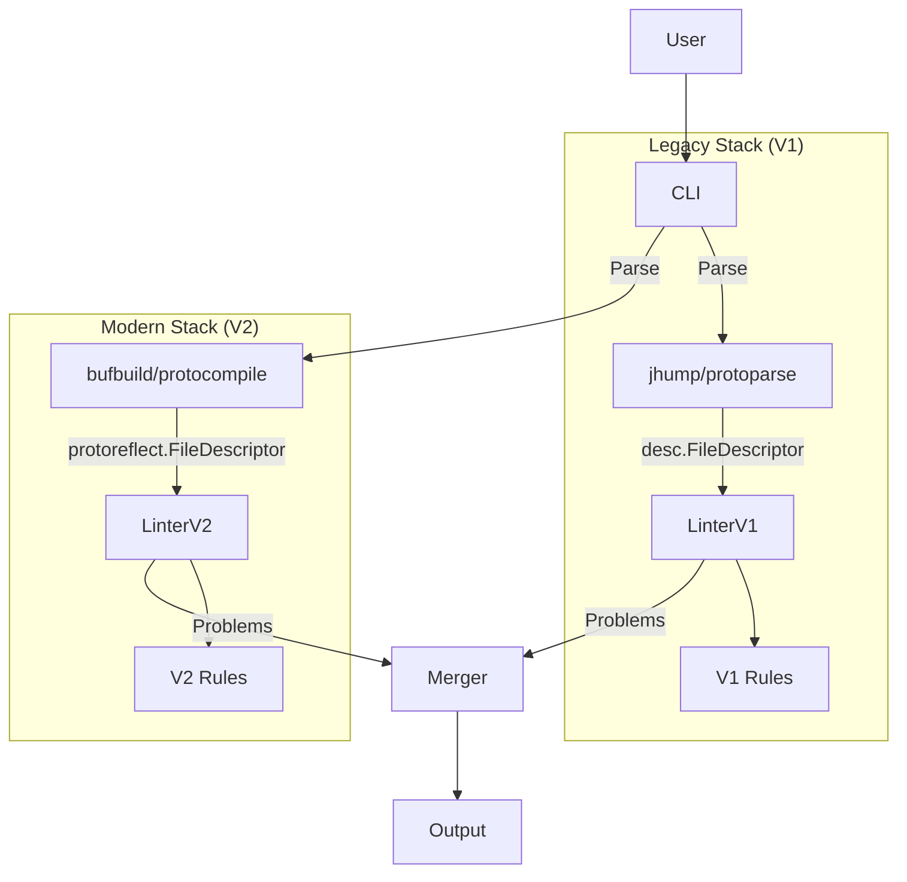

# Design Alternative: The "Dual Stack" Approach

**Status:** Alternative Consideration
**Concept:** Instead of adapting descriptors within a single linter, we run two completely separate execution pipelines (V1 and V2) and merge the results at the very end.

## 1. Architecture

## 2. Pros & Cons Analysis

### Pros
1.  **Isolation:** Failures in the new V2 parser (e.g., import resolution bugs) will not affect legacy checks. This provides the highest safety margin.
2.  **Simplicity of Implementation:**
    *   No need to modify `lint/lint.go` to handle type switching or adapters.
    *   No need to touch the `Problem` struct to support dual descriptor types (each stack produces standard Problems, we just interface them).
3.  **Clean Break:** When migration is done, we simply delete the "Legacy Stack" code block. No cleanup of adapter logic required inside the linter.

### Cons
1.  **Performance (Critical):**
    *   **Double Parsing:** We parse the entire AST twice. Parsing is typically the most expensive operation in a linter. This could double execution time and memory usage.
2.  **Registry Fragmentation:**
    *   We currently have one `globalRules` registry. We would need to split this into `globalRulesV1` and `globalRulesV2`.
    *   **User Config Complexity:** When a user says `--enable-rule=my-rule`, the CLI must check *both* registries to find it. If a rule moves from V1 to V2, the user config shouldn't need to change, but the CLI logic to find that rule becomes complex.
3.  **Inconsistent Parsing:**
    *   If `jhump` is lenient and `protocompile` is strict (or vice versa), the user might get a syntax error from one stack but not the other. This leads to confusing UX: "Why did it run half my rules and then error?"

## 3. Comparison with Hybrid Adapter

| Feature | Hybrid (Adapter) | Dual Stack |
| :--- | :--- | :--- |
| **Performance** | **High** (Parse once, cheap convert) | **Low** (Parse twice) |
| **Safety** | Medium (Shared runtime) | **High** (Isolated runtimes) |
| **Effort** | Medium (Refactor Linter core) | Low (Setup parallel loop) |
| **UX** | **Seamless** | Potentially Confusing (Syntax errors) |

## 4. Recommendation
**Reject Dual Stack.**

The performance penalty of double-parsing (essentially running the compiler front-end twice) is likely unacceptable for users with large API definitions. Furthermore, the complexity of managing two parallel rule registries and merging their configurations outweighs the code simplicity of avoiding an adapter.

The **Hybrid/Adapter** approach allows us to maintain a single "source of truth" for the parsed AST, ensuring consistent behavior and high performance.
